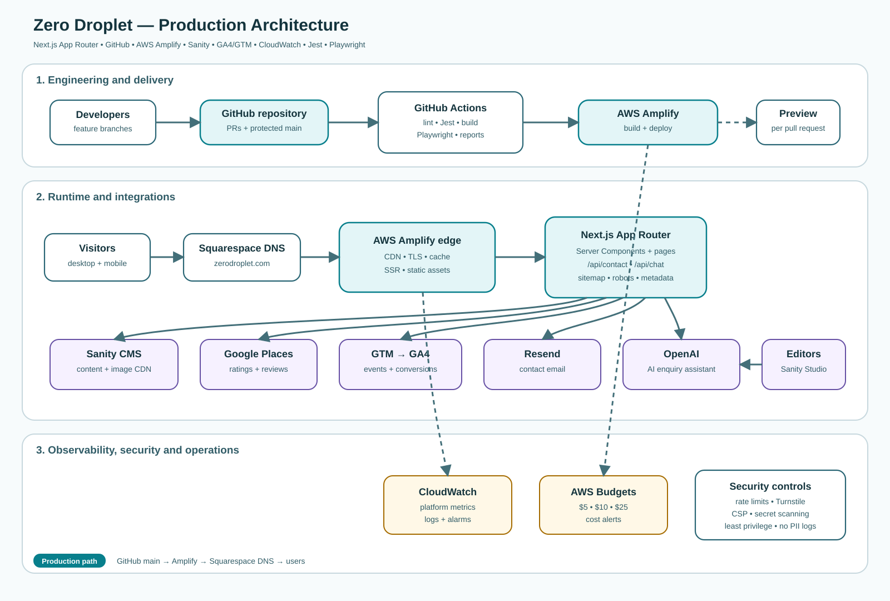
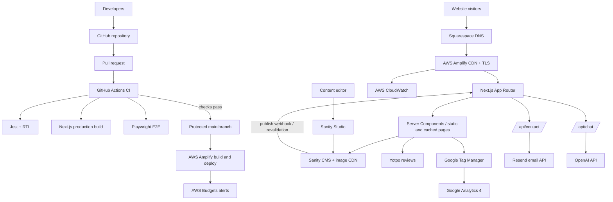

# Zero Droplet Website — Solution Architecture

## 1. Executive summary

Zero Droplet will use a managed, serverless-first architecture designed for a low-to-medium traffic business website with lead generation, CMS-managed content, ratings, analytics, monitoring and an AI enquiry assistant.

The source code is stored in **GitHub**. Pull requests run automated quality checks through **GitHub Actions**. The protected `main` branch is connected directly to **AWS Amplify Hosting**, which builds and deploys the Next.js application globally through a CDN.

The domain remains registered and managed in **Squarespace DNS**. The existing BigRock hosting can remain active during the migration and be allowed to expire after the new production deployment is stable and any email dependency has been checked.

## 2. Architecture diagram

## 3. Logical architecture

## 4. Deployment architecture

### Source control

- GitHub is the authoritative source for application code and configuration.
- `main` is the production branch.
- `develop` can be used as the integration branch if a two-branch workflow is required.
- Feature work is performed on short-lived branches.
- Pull requests are required before merging into `main`.

Recommended branch protections:

- Require at least one approval.
- Require the GitHub Actions `quality` and `e2e` checks.
- Require branches to be up to date before merging.
- Block direct pushes to `main`.
- Enable secret scanning and Dependabot alerts.

### Continuous integration

The included `.github/workflows/ci.yml` runs:

1. Dependency installation with `pnpm install --frozen-lockfile`.
2. ESLint checks.
3. Jest and React Testing Library tests.
4. A production Next.js build.
5. Playwright browser tests.
6. Playwright report upload when a test fails.

### Continuous deployment

AWS Amplify connects directly to the GitHub repository:

- Pull requests can receive temporary preview deployments.
- A merge into `main` triggers the production build.
- Amplify deploys static assets, server-rendered routes and Route Handlers.
- Production secrets are stored in Amplify environment variables, not GitHub.
- A failed build does not replace the last successful production deployment.

## 5. Application architecture

### Frontend

- Next.js App Router and React Server Components.
- Ant Design for accessible, reusable UI components.
- SCSS for brand styling and layout.
- Server-rendered metadata, robots and sitemap files for SEO.
- Responsive pages for desktop, tablet and mobile.

### Backend-for-frontend

Next.js Route Handlers provide a small backend layer:

- `/api/contact` validates enquiries and sends email through Resend.
- `/api/chat` protects the OpenAI key and applies the enquiry-assistant system prompt.
- Validation is performed server-side with Zod.
- External API errors are converted into safe user-facing responses.

This avoids maintaining a separate API service while the website remains relatively small.

### Content management

Sanity is the recommended CMS because it provides:

- A hosted content database.
- An editor-friendly Studio.
- Structured page, service, FAQ and case-study content.
- Image transformation and CDN delivery.
- Preview and future visual-editing support.
- No self-managed database or CMS server.

Suggested document types:

- Site settings
- Home page
- Service
- Case study/project
- FAQ
- Client/distributor
- SEO metadata

## 6. Integration architecture

### Yotpo

Yotpo is loaded as a client-side third-party integration and should be lazy loaded to protect Core Web Vitals. Site reviews are more suitable than product reviews for this service-led business.

### GA4 and GTM

Google Tag Manager is the preferred analytics entry point. GA4 is configured inside GTM. The application sends structured events to the data layer, including:

- `generate_lead`
- `contact_form_error`
- Future chat engagement and service-view events

Direct GA4 loading should remain disabled when GTM is configured to avoid duplicated page-view events.

### AI assistant

The AI assistant is a lead qualification and FAQ tool, not an engineering design or regulatory approval tool.

Controls should include:

- Server-only API key.
- Rate limiting.
- Input length limits.
- A clear AI disclosure.
- No guaranteed pricing, treatment result or compliance claims.
- Human handoff to the contact form.
- No sensitive data in logs.

## 7. Observability

### AWS CloudWatch and Budgets

CloudWatch provides AWS platform metrics, while AWS Budgets provides cost alerts. Recommended budget thresholds are USD 5, USD 10 and USD 25 per month.

Recommended operational alerts:

- 5xx error rate above 2% for five minutes.
- Contact API p95 latency above two seconds.
- Chat API p95 latency above eight seconds.
- Browser JavaScript error rate above 1%.
- LCP p75 above 2.5 seconds.
- INP p75 above 200 milliseconds.
- No successful synthetic contact check for ten minutes.

## 8. Security architecture

- TLS is terminated at the AWS edge.
- Secrets are stored in Amplify environment variables.
- No API key is exposed through `NEXT_PUBLIC_*` variables.
- Contact and chat input is validated server-side.
- Add Cloudflare Turnstile or equivalent bot protection before launch.
- Add IP or token-based rate limiting for `/api/contact` and `/api/chat`.
- Configure Content Security Policy and other security headers.
- Avoid logging email addresses, telephone numbers, messages and chat content.
- Apply least-privilege access to AWS, Sanity, Yotpo and analytics accounts.
- Enable GitHub secret scanning, Dependabot and two-factor authentication.

## 9. SEO architecture

The application includes:

- Route-level metadata.
- Canonical URLs.
- `robots.txt` generated through `robots.ts`.
- `sitemap.xml` generated through `sitemap.ts`.
- Server-rendered content for crawler accessibility.
- Semantic page headings.
- Optimised responsive images.
- Structured data can be added for Organisation, LocalBusiness, Service, FAQ and BreadcrumbList.

The sitemap must eventually source service and case-study URLs from Sanity so new published content is included automatically.

## 10. Testing strategy

### Unit and component tests

Jest and React Testing Library cover:

- Validation logic.
- Contact form behaviour.
- Analytics event calls.
- Sitemap entries.
- Components with important conditional behaviour.

### End-to-end tests

Playwright covers:

- Homepage rendering.
- Navigation.
- Contact form submission with mocked external delivery.
- Mobile and desktop layouts.
- Public sitemap availability.
- Critical lead-generation journeys.

### Production checks

Add a scheduled synthetic monitor for:

- Homepage availability.
- Contact page availability.
- Contact API health using a non-delivery test mode.
- Sitemap and robots availability.

## 11. Data flows

### Public page request

1. The visitor resolves `zerodroplet.com` through Squarespace DNS.
2. AWS Amplify serves cached assets and pages from the edge.
3. Next.js fetches structured content from Sanity when revalidation is required.
4. Yotpo and GTM load after the critical page content.

### Contact enquiry

1. The browser validates required fields.
2. The form posts to `/api/contact`.
3. The server validates and sanitises the payload.
4. Resend delivers the enquiry to the business inbox.
5. The browser emits `generate_lead` through GTM only after success.

### AI enquiry

1. The visitor sends a question to `/api/chat`.
2. The route applies validation, rate limiting and system instructions.
3. The server calls OpenAI.
4. The response is returned to the chat widget.
5. Complex enquiries are redirected to the contact form.

### Content publication

1. An editor updates content in Sanity Studio.
2. Sanity publishes the document.
3. A webhook triggers page revalidation or a new Amplify build when necessary.
4. Updated content becomes available through the CDN.

## 12. Why Amplify instead of raw Lambda

AWS Lambda is part of a valid serverless architecture, but a complete Next.js application also requires CDN routing, static asset hosting, server rendering, image optimisation, cache rules, deployment versioning and framework-aware build output.

Amplify manages those concerns and may use managed AWS compute behind the platform. Raw Lambda is better reserved for workloads that are independent of a user-facing Next.js request, such as:

- Scheduled CRM synchronisation.
- Processing uploaded water reports.
- Queue-based email or document jobs.
- Long-running external integrations.
- Sanity webhook processing.

For the current scope, Next.js Route Handlers on Amplify provide the simplest operational model.

## 13. Environment separation

Use three environments:

| Environment | Git source | Purpose |
|---|---|---|
| Local | Feature branch | Development and unit testing |
| Preview | Pull request | Stakeholder review and E2E validation |
| Production | `main` | Public website |

Each environment should have separate values for the Sanity dataset, analytics and external API keys where practical.

## 14. Migration plan

1. Push the project to a private GitHub repository.
2. Enable branch protection and GitHub Actions.
3. Create the Sanity project and migrate existing content.
4. Configure Resend, Yotpo, GTM/GA4 and OpenAI.
5. Connect the GitHub repository to AWS Amplify.
6. Validate the Amplify preview domain.
7. Add the production domain in Amplify.
8. Update only the required Squarespace DNS records.
9. Preserve email-related MX, SPF, DKIM and DMARC records.
10. Keep BigRock active during the rollback period.
11. Submit the production sitemap to Google Search Console.
12. Let BigRock expire after the website and email dependencies are confirmed stable.

## 15. Architecture decisions

| Decision | Selected option | Reason |
|---|---|---|
| Framework | Next.js App Router | SEO, server rendering, integrated frontend/backend |
| UI | Ant Design + SCSS | Fast development with custom branding |
| Package manager | pnpm | Efficient deterministic dependency management |
| Source control | GitHub | Pull requests, protections and CI integration |
| CI | GitHub Actions | Native repository automation |
| Hosting | AWS Amplify | Managed serverless Next.js deployment |
| CMS | Sanity | Hosted free tier and strong Next.js integration |
| Email | Resend | Simple transactional API |
| AI | OpenAI via server route | Secure key and controlled prompt |
| Analytics | GTM + GA4 | Flexible event management |
| Monitoring | CloudWatch | Application and platform visibility |
| Testing | Jest + Playwright | Component and browser-level confidence |
